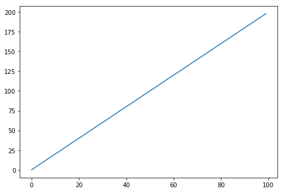
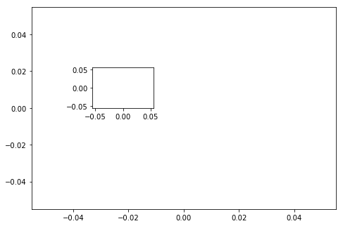
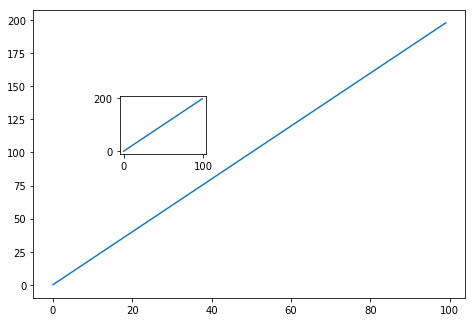
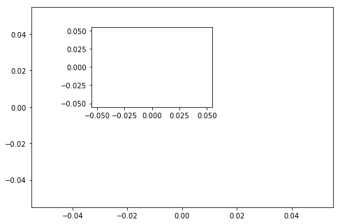
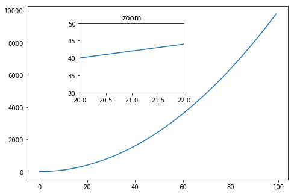
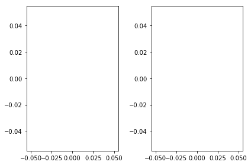
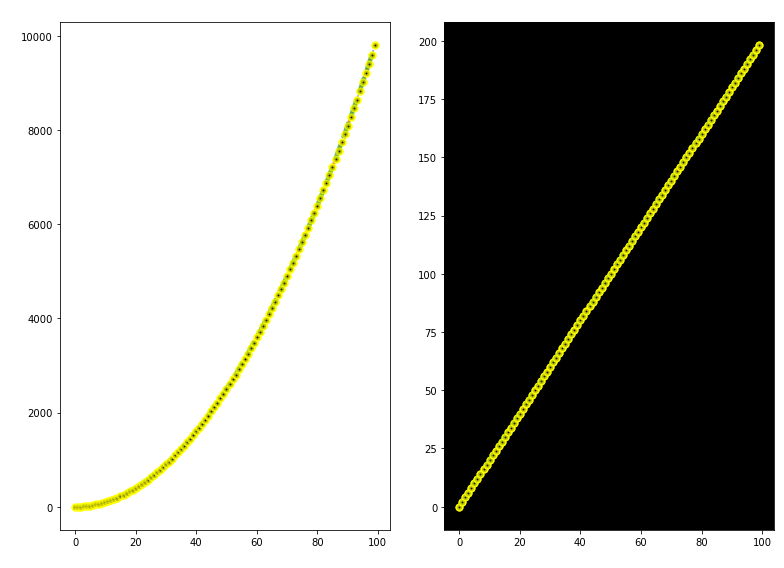
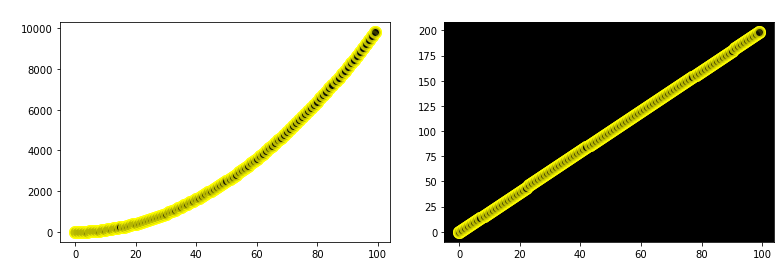

# Matplotlib Exercises 

Welcome to the exercises for reviewing matplotlib! Take your time with these, Matplotlib can be tricky to understand at first. These are relatively simple plots, but they can be hard if this is your first time with matplotlib, feel free to reference the solutions as you go along.

Also don't worry if you find the matplotlib syntax frustrating, we actually won't be using it that often throughout the course, we will switch to using seaborn and pandas built-in visualization capabilities. But, those are built-off of matplotlib, which is why it is still important to get exposure to it!

** * NOTE: ALL THE COMMANDS FOR PLOTTING A FIGURE SHOULD ALL GO IN THE SAME CELL. SEPARATING THEM OUT INTO MULTIPLE CELLS MAY CAUSE NOTHING TO SHOW UP. * **

# Exercises

Follow the instructions to recreate the plots using this data:

## Data


```python
import numpy as np
x = np.arange(0,100)
y = x*2
z = x**2
```

** Import matplotlib.pyplot as plt and set %matplotlib inline if you are using the jupyter notebook. What command do you use if you aren't using the jupyter notebook?**


```python
from matplotlib import pyplot as plt
%matplotlib inline
```

## Exercise 1

** Follow along with these steps: **
* ** Create a figure object called fig using plt.figure() **
* ** Use add_axes to add an axis to the figure canvas at [0,0,1,1]. Call this new axis ax. **
* ** Plot (x,y) on that axes and set the labels and titles to match the plot below:**


```python
fig = plt.figure()
axes = fig.add_axes([0,0,1,1])
axes.plot(x,y)
```


    [<matplotlib.lines.Line2D at 0x204cc5bb4a8>]





## Exercise 2
** Create a figure object and put two axes on it, ax1 and ax2. Located at [0,0,1,1] and [0.2,0.5,.2,.2] respectively.**


```python
fig = plt.figure()
ax1 = fig.add_axes([0,0,1,1])
ax2 = fig.add_axes([0.2,0.5,.2,.2])
ax1.plot()
ax2.plot()
```


    []





** Now plot (x,y) on both axes. And call your figure object to show it.**


```python
fig = plt.figure()
ax1 = fig.add_axes([0,0,1,1])
ax2 = fig.add_axes([0.2,0.5,.2,.2])
ax1.plot(x,y)
ax2.plot(x,y)
```


    [<matplotlib.lines.Line2D at 0x204ccbcfe10>]





## Exercise 3

** Create the plot below by adding two axes to a figure object at [0,0,1,1] and [0.2,0.5,.4,.4]**


```python
fig = plt.figure()
ax1 = fig.add_axes([0,0,1,1])
ax2 = fig.add_axes([0.2,0.5,.4,.4])
ax1.plot()
ax2.plot()
```


    []





** Now use x,y, and z arrays to recreate the plot below. Notice the xlimits and y limits on the inserted plot:**


```python
fig = plt.figure()
ax1 = fig.add_axes([0,0,1,1])
ax2 = fig.add_axes([0.2,0.5,.4,.4])
ax1.plot(x,z)
ax2.plot(x,y)
ax2.set_title('zoom')
ax2.set_xlim([20,22])
ax2.set_ylim([30,50])
```


    (30, 50)





## Exercise 4

** Use plt.subplots(nrows=1, ncols=2) to create the plot below.**


```python
fig,axes = plt.subplots(nrows=1, ncols=2)
for i, a in  enumerate(axes):
    a.plot()
    
plt.tight_layout()
```





** Now plot (x,y) and (x,z) on the axes. Play around with the linewidth and style**


```python
fig,axes = plt.subplots(nrows=1, ncols=2, figsize=(11,8))
for i, a in  enumerate(axes):
    list = range(1,4)
    for n in list:
        r = np.random.randint(1000)
        exp = y
        if i % 2 == 0:
            exp = z
        a.plot(x,exp, label= 'X*'+str(exp), 
               linewidth=n*1.5, #look and feel opts
               alpha=0.7, 
               linestyle='--', 
               marker='.',
              markersize=10,
              markerfacecolor='black',
              markeredgewidth=3,
              markeredgecolor='yellow')
        
    a.set_xlabel('X', color='white')
    a.set_ylabel('Y', color='white')
    bg_color = 'black'
    if i % 2 == 0:
        bg_color = 'white'
    a.set_axis_bgcolor(bg_color)
    plot_title = 'Plot ' + str((i+1))
    a.set_title(plot_title, color='white')

    
plt.tight_layout()
```

    C:\ProgramData\Anaconda3\lib\site-packages\ipykernel_launcher.py:24: MatplotlibDeprecationWarning: The set_axis_bgcolor function was deprecated in version 2.0. Use set_facecolor instead.
    





** See if you can resize the plot by adding the figsize() argument in plt.subplots() are copying and pasting your previous code.**


```python
fig,axes = plt.subplots(nrows=1, ncols=2, figsize=(11,4))
for i, a in  enumerate(axes):
    list = range(1,4)
    for n in list:
        r = np.random.randint(1000)
        exp = y
        if i % 2 == 0:
            exp = z
        a.plot(x,exp, label= 'X*'+str(exp), 
               linewidth=n*1.5, #look and feel opts
               alpha=0.7, 
               linestyle='-.', 
               marker='o',
              markersize=10,
              markerfacecolor='black',
              markeredgewidth=3,
              markeredgecolor='yellow')
        
    a.set_xlabel('X', color='white')
    a.set_ylabel('Y', color='white')
    bg_color = 'black'
    if i % 2 == 0:
        bg_color = 'white'
    a.set_axis_bgcolor(bg_color)
    plot_title = 'Plot ' + str((i+1))
    a.set_title(plot_title, color='white')

    
plt.tight_layout()
```

    C:\ProgramData\Anaconda3\lib\site-packages\ipykernel_launcher.py:24: MatplotlibDeprecationWarning: The set_axis_bgcolor function was deprecated in version 2.0. Use set_facecolor instead.
    





# Great Job!
