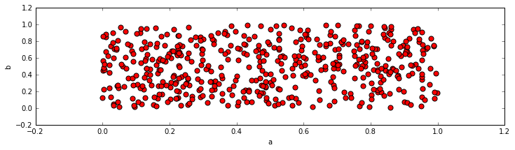
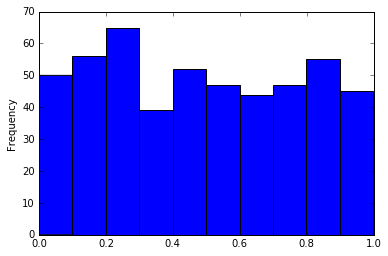
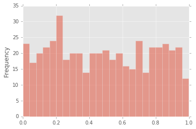
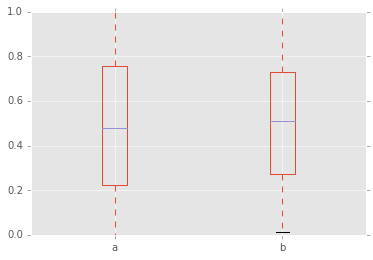
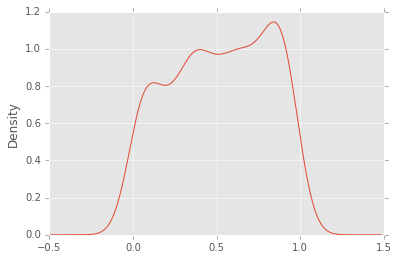
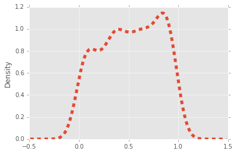
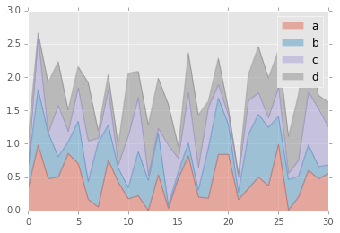
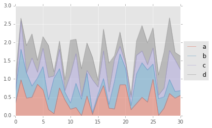

___

<a href='http://www.pieriandata.com'> </a>
___
# Pandas Data Visualization Exercise

This is just a quick exercise for you to review the various plots we showed earlier. Use **df3** to replicate the following plots. 


```python
import pandas as pd
import matplotlib.pyplot as plt
df3 = pd.read_csv('df3')
%matplotlib inline
```


```python
df3.info()
```

    <class 'pandas.core.frame.DataFrame'>
    RangeIndex: 500 entries, 0 to 499
    Data columns (total 4 columns):
    a    500 non-null float64
    b    500 non-null float64
    c    500 non-null float64
    d    500 non-null float64
    dtypes: float64(4)
    memory usage: 15.7 KB
    


```python
df3.head()
```


<div>
<table border="1" class="dataframe">
  <thead>
    <tr style="text-align: right;">
      <th></th>
      <th>a</th>
      <th>b</th>
      <th>c</th>
      <th>d</th>
    </tr>
  </thead>
  <tbody>
    <tr>
      <th>0</th>
      <td>0.336272</td>
      <td>0.325011</td>
      <td>0.001020</td>
      <td>0.401402</td>
    </tr>
    <tr>
      <th>1</th>
      <td>0.980265</td>
      <td>0.831835</td>
      <td>0.772288</td>
      <td>0.076485</td>
    </tr>
    <tr>
      <th>2</th>
      <td>0.480387</td>
      <td>0.686839</td>
      <td>0.000575</td>
      <td>0.746758</td>
    </tr>
    <tr>
      <th>3</th>
      <td>0.502106</td>
      <td>0.305142</td>
      <td>0.768608</td>
      <td>0.654685</td>
    </tr>
    <tr>
      <th>4</th>
      <td>0.856602</td>
      <td>0.171448</td>
      <td>0.157971</td>
      <td>0.321231</td>
    </tr>
  </tbody>
</table>
</div>


** Recreate this scatter plot of b vs a. Note the color and size of the points. Also note the figure size. See if you can figure out how to stretch it in a similar fashion. Remeber back to your matplotlib lecture...**


```python

```


    <matplotlib.axes._subplots.AxesSubplot at 0x1176a7da0>





** Create a histogram of the 'a' column.**


```python

```


    <matplotlib.axes._subplots.AxesSubplot at 0x1177a2860>





** These plots are okay, but they don't look very polished. Use style sheets to set the style to 'ggplot' and redo the histogram from above. Also figure out how to add more bins to it.***


```python

```


    <matplotlib.axes._subplots.AxesSubplot at 0x11a87b908>





** Create a boxplot comparing the a and b columns.**


```python

```


    <matplotlib.axes._subplots.AxesSubplot at 0x1177c4a20>





** Create a kde plot of the 'd' column **


```python

```


    <matplotlib.axes._subplots.AxesSubplot at 0x11abb6278>





** Figure out how to increase the linewidth and make the linestyle dashed. (Note: You would usually not dash a kde plot line)**


```python

```


    <matplotlib.axes._subplots.AxesSubplot at 0x11ab9acc0>





** Create an area plot of all the columns for just the rows up to 30. (hint: use .ix).**


```python

```


    <matplotlib.axes._subplots.AxesSubplot at 0x11ccdfbe0>





## Bonus Challenge!
Note, you may find this really hard, reference the solutions if you can't figure it out!
** Notice how the legend in our previous figure overlapped some of actual diagram. Can you figure out how to display the legend outside of the plot as shown below?**

** Try searching Google for a good stackoverflow link on this topic. If you can't find it on your own - [use this one for a hint.](http://stackoverflow.com/questions/23556153/how-to-put-legend-outside-the-plot-with-pandas)**


```python

```





# Great Job!
