# Categorical Data Plots

Now let's discuss using seaborn to plot categorical data! There are a few main plot types for this:

* factorplot
* boxplot
* violinplot
* stripplot
* swarmplot
* barplot
* countplot

Let's go through examples of each!


```python
import seaborn as sns
import matplotlib.pyplot as plt

%matplotlib inline
plt.style.use('fivethirtyeight')
plt.rcParams['figure.figsize'] = (15,5)
```


```python
tips = sns.load_dataset('tips')
tips.head()
```


<div>
<style>
    .dataframe thead tr:only-child th {
        text-align: right;
    }

    .dataframe thead th {
        text-align: left;
    }

    .dataframe tbody tr th {
        vertical-align: top;
    }
</style>
<table border="1" class="dataframe">
  <thead>
    <tr style="text-align: right;">
      <th></th>
      <th>total_bill</th>
      <th>tip</th>
      <th>sex</th>
      <th>smoker</th>
      <th>day</th>
      <th>time</th>
      <th>size</th>
    </tr>
  </thead>
  <tbody>
    <tr>
      <th>0</th>
      <td>16.99</td>
      <td>1.01</td>
      <td>Female</td>
      <td>No</td>
      <td>Sun</td>
      <td>Dinner</td>
      <td>2</td>
    </tr>
    <tr>
      <th>1</th>
      <td>10.34</td>
      <td>1.66</td>
      <td>Male</td>
      <td>No</td>
      <td>Sun</td>
      <td>Dinner</td>
      <td>3</td>
    </tr>
    <tr>
      <th>2</th>
      <td>21.01</td>
      <td>3.50</td>
      <td>Male</td>
      <td>No</td>
      <td>Sun</td>
      <td>Dinner</td>
      <td>3</td>
    </tr>
    <tr>
      <th>3</th>
      <td>23.68</td>
      <td>3.31</td>
      <td>Male</td>
      <td>No</td>
      <td>Sun</td>
      <td>Dinner</td>
      <td>2</td>
    </tr>
    <tr>
      <th>4</th>
      <td>24.59</td>
      <td>3.61</td>
      <td>Female</td>
      <td>No</td>
      <td>Sun</td>
      <td>Dinner</td>
      <td>4</td>
    </tr>
  </tbody>
</table>
</div>


## barplot and countplot

These very similar plots allow you to get aggregate data off a categorical feature in your data. **barplot** is a general plot that allows you to aggregate the categorical data based off some function, by default the mean:


```python
sns.barplot(x='sex',y='total_bill',data=tips)
```


    <matplotlib.axes._subplots.AxesSubplot at 0x1e0bdddb9b0>


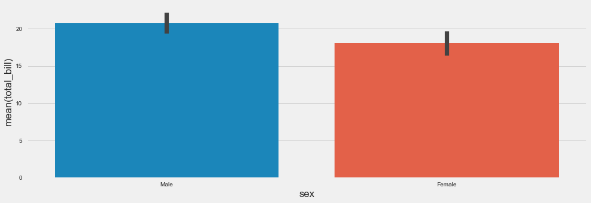


```python
import numpy as np
```

You can change the estimator object to your own function, that converts a vector to a scalar:


```python
sns.barplot(x='sex',y='total_bill',data=tips,estimator=np.std)
```


    <matplotlib.axes._subplots.AxesSubplot at 0x1e0bdf12a58>


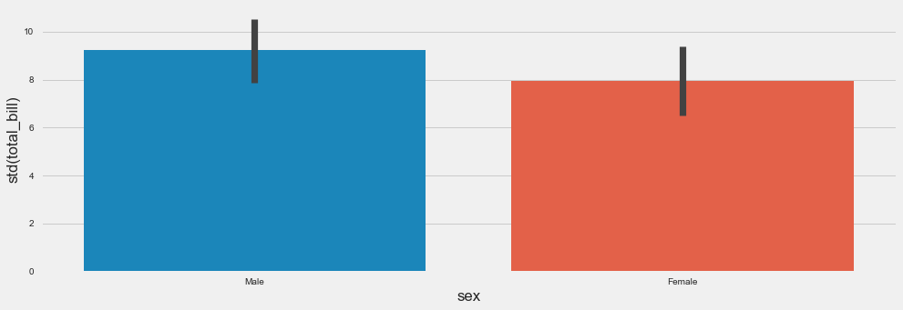


### countplot

This is essentially the same as barplot except the estimator is explicitly counting the number of occurrences. Which is why we only pass the x value:


```python
sns.countplot(x='sex',data=tips)
```


    <matplotlib.axes._subplots.AxesSubplot at 0x1e0bdf7b470>


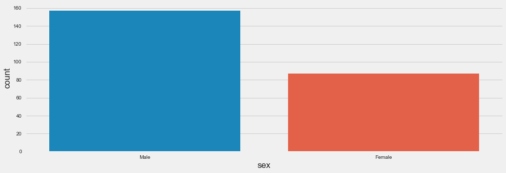


## boxplot and violinplot

boxplots and violinplots are used to shown the distribution of categorical data. A box plot (or box-and-whisker plot) shows the distribution of quantitative data in a way that facilitates comparisons between variables or across levels of a categorical variable. The box shows the quartiles of the dataset while the whiskers extend to show the rest of the distribution, except for points that are determined to be “outliers” using a method that is a function of the inter-quartile range.


```python
sns.boxplot(x="day", y="total_bill", data=tips,palette='rainbow')
```


    <matplotlib.axes._subplots.AxesSubplot at 0x1e0bdff4be0>


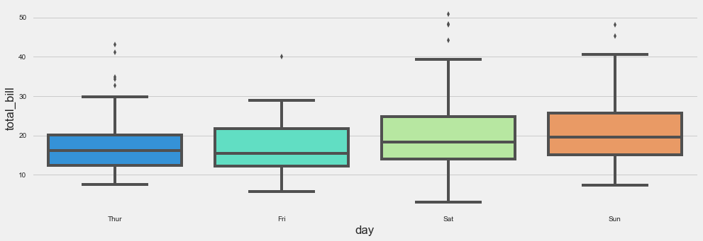


```python
# Can do entire dataframe with orient='h'
sns.boxplot(data=tips,palette='rainbow',orient='h')
```


    <matplotlib.axes._subplots.AxesSubplot at 0x1e0be05d940>


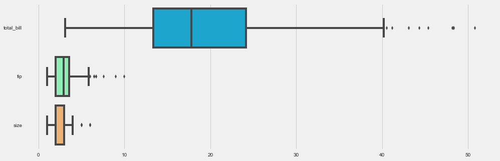


```python
sns.boxplot(x="day", y="total_bill", hue="smoker",data=tips, palette="coolwarm")
```


    <matplotlib.axes._subplots.AxesSubplot at 0x1e0be33a470>


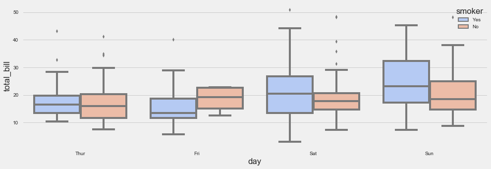


### violinplot
A violin plot plays a similar role as a box and whisker plot. It shows the distribution of quantitative data across several levels of one (or more) categorical variables such that those distributions can be compared. Unlike a box plot, in which all of the plot components correspond to actual datapoints, the violin plot features a kernel density estimation of the underlying distribution.


```python
sns.violinplot(x="day", y="total_bill", data=tips,palette='rainbow')
```


    <matplotlib.axes._subplots.AxesSubplot at 0x1e0be80c2b0>


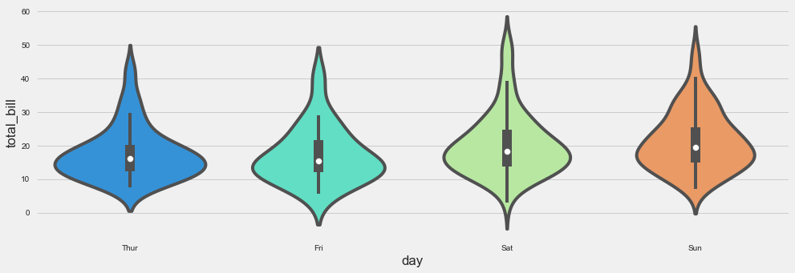


```python
sns.violinplot(x="day", y="total_bill", data=tips,hue='sex',palette='Set1')
```


    <matplotlib.axes._subplots.AxesSubplot at 0x1e0be801f60>


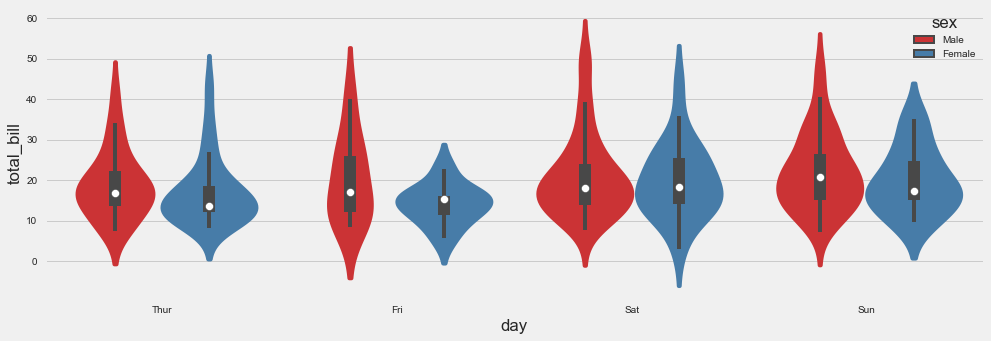


```python
sns.violinplot(x="day", y="total_bill", data=tips,hue='sex',split=True,palette='Set1')
```


    <matplotlib.axes._subplots.AxesSubplot at 0x1e0be2c7828>


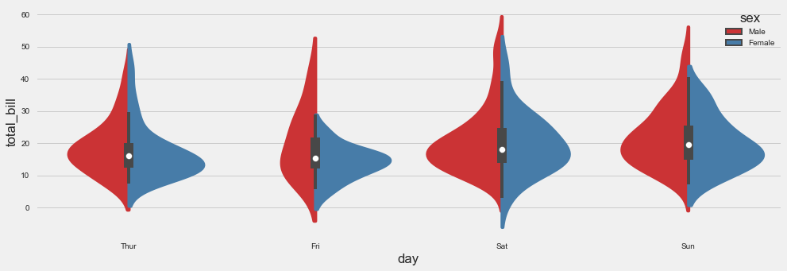


## stripplot and swarmplot
The stripplot will draw a scatterplot where one variable is categorical. A strip plot can be drawn on its own, but it is also a good complement to a box or violin plot in cases where you want to show all observations along with some representation of the underlying distribution.

The swarmplot is similar to stripplot(), but the points are adjusted (only along the categorical axis) so that they don’t overlap. This gives a better representation of the distribution of values, although it does not scale as well to large numbers of observations (both in terms of the ability to show all the points and in terms of the computation needed to arrange them).


```python
sns.stripplot(x="day", y="total_bill", data=tips)
```


    <matplotlib.axes._subplots.AxesSubplot at 0x1e0be83d320>


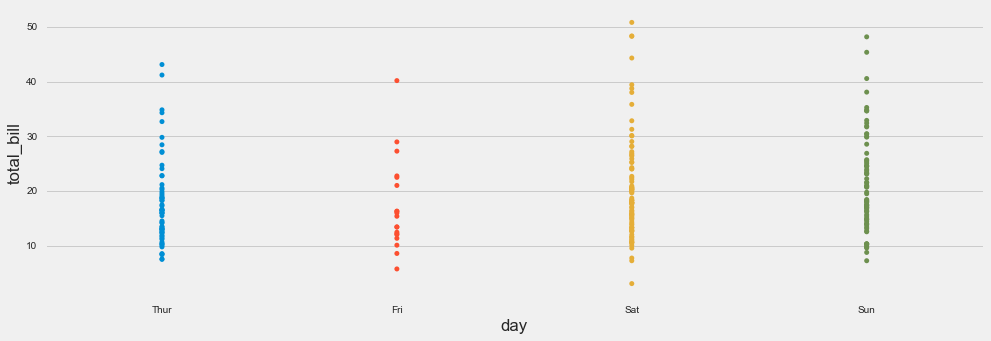


```python
sns.stripplot(x="day", y="total_bill", data=tips,jitter=True)
```


    <matplotlib.axes._subplots.AxesSubplot at 0x1e0beea82e8>


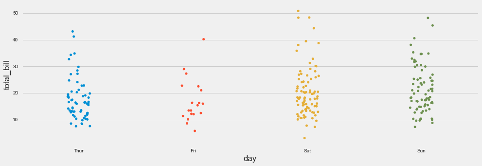


```python
sns.stripplot(x="day", y="total_bill", data=tips,jitter=True,hue='sex',palette='Set1')
```


    <matplotlib.axes._subplots.AxesSubplot at 0x1e0bef179b0>


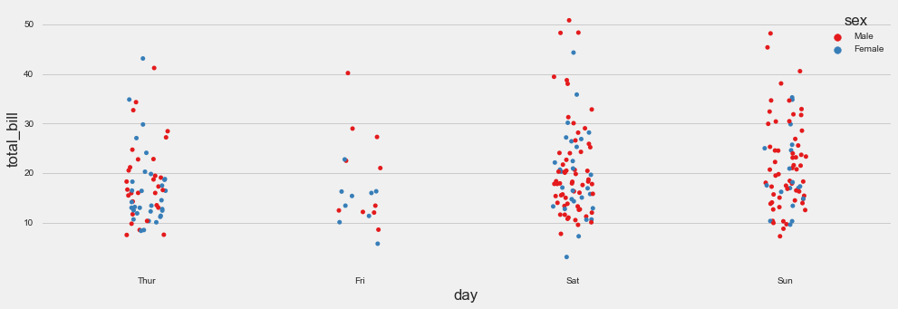


```python
sns.stripplot(x="day", y="total_bill", data=tips,jitter=True,hue='sex',palette='Set1',split=True)
```


    <matplotlib.axes._subplots.AxesSubplot at 0x1e0bf300b70>


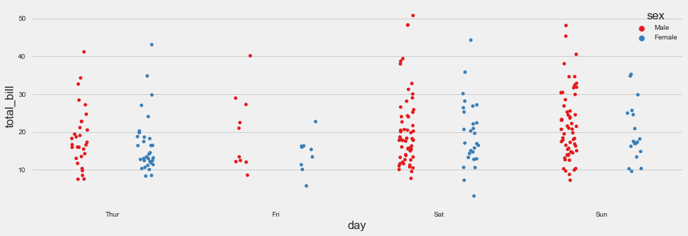


```python
sns.swarmplot(x="day", y="total_bill", data=tips)
```


    <matplotlib.axes._subplots.AxesSubplot at 0x1e0bf39f7f0>


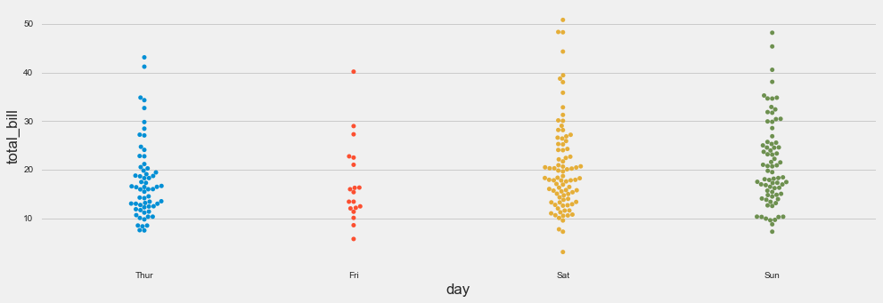


```python
sns.swarmplot(x="day", y="total_bill",hue='sex',data=tips, palette="Set1", split=True)
```


    <matplotlib.axes._subplots.AxesSubplot at 0x1e0bf403a90>


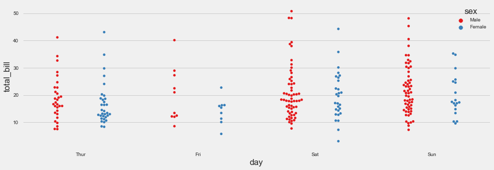


### Combining Categorical Plots


```python
sns.violinplot(x="tip", y="day", data=tips,palette='rainbow')
sns.swarmplot(x="tip", y="day", data=tips,color='red',size=6)
```


    <matplotlib.axes._subplots.AxesSubplot at 0x1e0c1373b00>


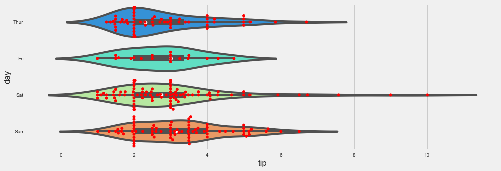


```python
sns.violinplot(x="day", y="tip", data=tips,palette='rainbow')
sns.swarmplot(x="day", y="tip", data=tips,color='red',size=6)
```


    <matplotlib.axes._subplots.AxesSubplot at 0x1e0c16a0940>


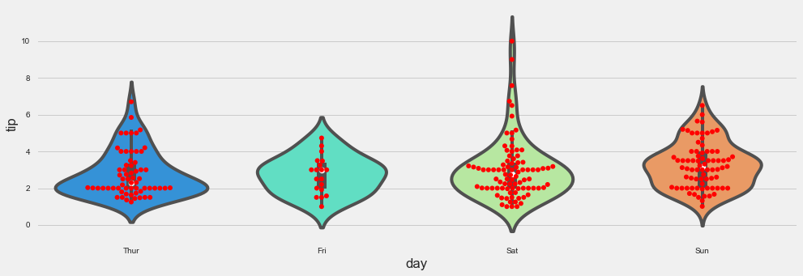


## factorplot

factorplot is the most general form of a categorical plot. It can take in a **kind** parameter to adjust the plot type:


```python
sns.factorplot(x='day',y='total_bill',data=tips,kind='bar')
```


    <seaborn.axisgrid.FacetGrid at 0x1e0c0eab780>


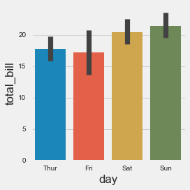


```python
sns.factorplot(x='sex',y='total_bill',data=tips,kind='bar')
```


    <seaborn.axisgrid.FacetGrid at 0x1e0c13c2ef0>


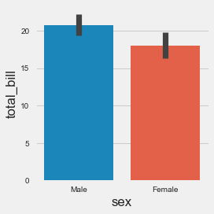


# Great Job!
