# Distribution Plots

Let's discuss some plots that allow us to visualize the distribution of a data set. These plots are:

* distplot
* jointplot
* pairplot
* rugplot
* kdeplot

___
## Imports


```python
import seaborn as sns
%matplotlib inline
```

## Data
Seaborn comes with built-in data sets!


```python
tips = sns.load_dataset('tips')
```


```python
tips.head()
```


<div>
<style>
    .dataframe thead tr:only-child th {
        text-align: right;
    }

    .dataframe thead th {
        text-align: left;
    }

    .dataframe tbody tr th {
        vertical-align: top;
    }
</style>
<table border="1" class="dataframe">
  <thead>
    <tr style="text-align: right;">
      <th></th>
      <th>total_bill</th>
      <th>tip</th>
      <th>sex</th>
      <th>smoker</th>
      <th>day</th>
      <th>time</th>
      <th>size</th>
    </tr>
  </thead>
  <tbody>
    <tr>
      <th>0</th>
      <td>16.99</td>
      <td>1.01</td>
      <td>Female</td>
      <td>No</td>
      <td>Sun</td>
      <td>Dinner</td>
      <td>2</td>
    </tr>
    <tr>
      <th>1</th>
      <td>10.34</td>
      <td>1.66</td>
      <td>Male</td>
      <td>No</td>
      <td>Sun</td>
      <td>Dinner</td>
      <td>3</td>
    </tr>
    <tr>
      <th>2</th>
      <td>21.01</td>
      <td>3.50</td>
      <td>Male</td>
      <td>No</td>
      <td>Sun</td>
      <td>Dinner</td>
      <td>3</td>
    </tr>
    <tr>
      <th>3</th>
      <td>23.68</td>
      <td>3.31</td>
      <td>Male</td>
      <td>No</td>
      <td>Sun</td>
      <td>Dinner</td>
      <td>2</td>
    </tr>
    <tr>
      <th>4</th>
      <td>24.59</td>
      <td>3.61</td>
      <td>Female</td>
      <td>No</td>
      <td>Sun</td>
      <td>Dinner</td>
      <td>4</td>
    </tr>
  </tbody>
</table>
</div>


## distplot

The distplot shows the distribution of a univariate set of observations.


```python
sns.distplot(tips['total_bill'])
# Safe to ignore warnings
```


    <matplotlib.axes._subplots.AxesSubplot at 0x13f61671fd0>


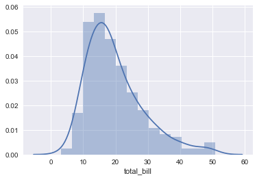


To remove the kde layer and just have the histogram use:


```python
sns.distplot(tips['total_bill'],kde=False,bins=30)
```


    <matplotlib.axes._subplots.AxesSubplot at 0x13f61a47dd8>


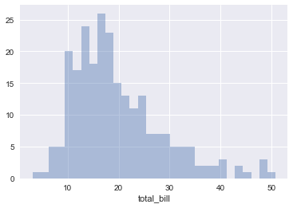


## jointplot

jointplot() allows you to basically match up two distplots for bivariate data. With your choice of what **kind** parameter to compare with: 
* “scatter” 
* “reg” 
* “resid” 
* “kde” 
* “hex”


```python
sns.jointplot(x='total_bill',y='tip',data=tips,kind='scatter')
```


    <seaborn.axisgrid.JointGrid at 0x13f61a478d0>


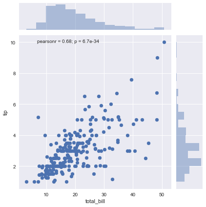


```python
sns.jointplot(x='total_bill',y='tip',data=tips,kind='hex')
```


    <seaborn.axisgrid.JointGrid at 0x13f62f66fd0>


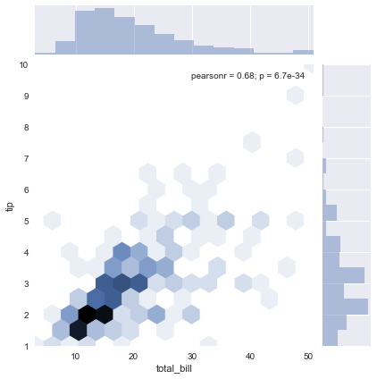


```python
sns.jointplot(x='total_bill',y='tip',data=tips,kind='reg')
```


    <seaborn.axisgrid.JointGrid at 0x13f631b7a20>


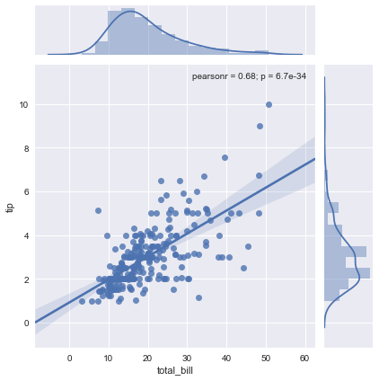


## pairplot

pairplot will plot pairwise relationships across an entire dataframe (for the numerical columns) and supports a color hue argument (for categorical columns). 


```python
sns.pairplot(tips)
```


    <seaborn.axisgrid.PairGrid at 0x13f631b7518>


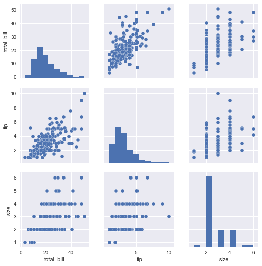


```python
sns.pairplot(tips,hue='sex',palette='coolwarm')
```


    <seaborn.axisgrid.PairGrid at 0x13f63a4f908>


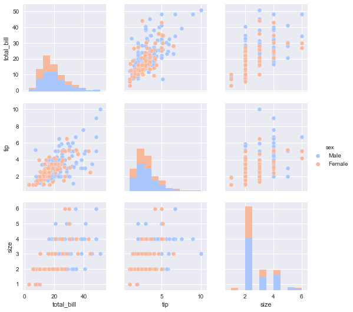


## rugplot

rugplots are actually a very simple concept, they just draw a dash mark for every point on a univariate distribution. They are the building block of a KDE plot:


```python
sns.rugplot(tips['total_bill'])
```


    <matplotlib.axes._subplots.AxesSubplot at 0x13f64541278>


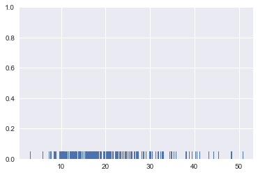


## kdeplot

kdeplots are [Kernel Density Estimation plots](http://en.wikipedia.org/wiki/Kernel_density_estimation#Practical_estimation_of_the_bandwidth). These KDE plots replace every single observation with a Gaussian (Normal) distribution centered around that value. For example:


```python
# Don't worry about understanding this code!
# It's just for the diagram below
import numpy as np
import matplotlib.pyplot as plt
from scipy import stats

#Create dataset
dataset = np.random.randn(25)

# Create another rugplot
sns.rugplot(dataset);

# Set up the x-axis for the plot
x_min = dataset.min() - 2
x_max = dataset.max() + 2

# 100 equally spaced points from x_min to x_max
x_axis = np.linspace(x_min,x_max,100)

# Set up the bandwidth, for info on this:
url = 'http://en.wikipedia.org/wiki/Kernel_density_estimation#Practical_estimation_of_the_bandwidth'

bandwidth = ((4*dataset.std()**5)/(3*len(dataset)))**.2


# Create an empty kernel list
kernel_list = []

# Plot each basis function
for data_point in dataset:
    
    # Create a kernel for each point and append to list
    kernel = stats.norm(data_point,bandwidth).pdf(x_axis)
    kernel_list.append(kernel)
    
    #Scale for plotting
    kernel = kernel / kernel.max()
    kernel = kernel * .4
    plt.plot(x_axis,kernel,color = 'grey',alpha=0.5)

plt.ylim(0,1)
```


    (0, 1)


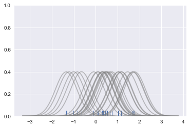


```python
# To get the kde plot we can sum these basis functions.

# Plot the sum of the basis function
sum_of_kde = np.sum(kernel_list,axis=0)

# Plot figure
fig = plt.plot(x_axis,sum_of_kde,color='indianred')

# Add the initial rugplot
sns.rugplot(dataset,c = 'indianred')

# Get rid of y-tick marks
plt.yticks([])

# Set title
plt.suptitle("Sum of the Basis Functions")
```


    <matplotlib.text.Text at 0x13f619bb358>


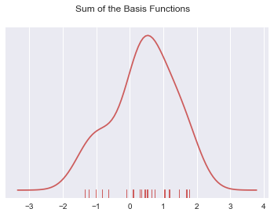


So with our tips dataset:


```python
sns.kdeplot(tips['total_bill'])
sns.rugplot(tips['total_bill'])
```


    <matplotlib.axes._subplots.AxesSubplot at 0x13f65ee30b8>


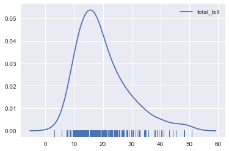


```python
sns.kdeplot(tips['tip'])
sns.rugplot(tips['tip'])
```


    <matplotlib.axes._subplots.AxesSubplot at 0x13f664cac88>


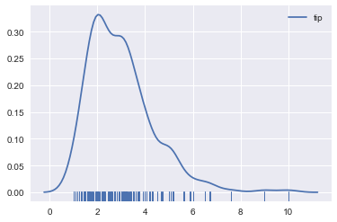


# Great Job!
