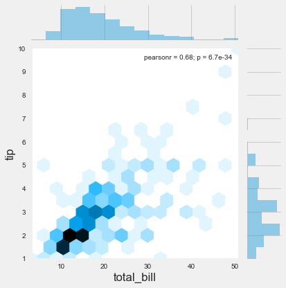

```python
import seaborn as sns
import matplotlib.pyplot as plt

%matplotlib inline
plt.style.use('fivethirtyeight')
plt.rcParams['figure.figsize'] = (15,5)
```


```python
tips = sns.load_dataset('tips')
```


```python
tips.head()
```


<div>
<style>
    .dataframe thead tr:only-child th {
        text-align: right;
    }

    .dataframe thead th {
        text-align: left;
    }

    .dataframe tbody tr th {
        vertical-align: top;
    }
</style>
<table border="1" class="dataframe">
  <thead>
    <tr style="text-align: right;">
      <th></th>
      <th>total_bill</th>
      <th>tip</th>
      <th>sex</th>
      <th>smoker</th>
      <th>day</th>
      <th>time</th>
      <th>size</th>
    </tr>
  </thead>
  <tbody>
    <tr>
      <th>0</th>
      <td>16.99</td>
      <td>1.01</td>
      <td>Female</td>
      <td>No</td>
      <td>Sun</td>
      <td>Dinner</td>
      <td>2</td>
    </tr>
    <tr>
      <th>1</th>
      <td>10.34</td>
      <td>1.66</td>
      <td>Male</td>
      <td>No</td>
      <td>Sun</td>
      <td>Dinner</td>
      <td>3</td>
    </tr>
    <tr>
      <th>2</th>
      <td>21.01</td>
      <td>3.50</td>
      <td>Male</td>
      <td>No</td>
      <td>Sun</td>
      <td>Dinner</td>
      <td>3</td>
    </tr>
    <tr>
      <th>3</th>
      <td>23.68</td>
      <td>3.31</td>
      <td>Male</td>
      <td>No</td>
      <td>Sun</td>
      <td>Dinner</td>
      <td>2</td>
    </tr>
    <tr>
      <th>4</th>
      <td>24.59</td>
      <td>3.61</td>
      <td>Female</td>
      <td>No</td>
      <td>Sun</td>
      <td>Dinner</td>
      <td>4</td>
    </tr>
  </tbody>
</table>
</div>


```python
sns.distplot(tips['total_bill'])
```


    <matplotlib.axes._subplots.AxesSubplot at 0x28ca9446978>


```python
sns.distplot(tips['total_bill'], kde=False)
```


    <matplotlib.axes._subplots.AxesSubplot at 0x28cad797da0>


```python
sns.distplot(tips['total_bill'], bins=50)
```


    <matplotlib.axes._subplots.AxesSubplot at 0x28cad7975c0>


```python
sns.jointplot(data=tips, x='total_bill', y='tip')
```


    <seaborn.axisgrid.JointGrid at 0x28cadb81518>


```python
sns.jointplot(data=tips, x='total_bill', y='tip', kind='hex')
```


    <seaborn.axisgrid.JointGrid at 0x28cae0abcf8>





```python
sns.jointplot(data=tips, x='total_bill', y='tip', kind='reg')
```


    <seaborn.axisgrid.JointGrid at 0x28cae0ab710>


```python
sns.jointplot(data=tips, x='total_bill', y='tip', kind='kde')
```


    <seaborn.axisgrid.JointGrid at 0x28caf4b5b38>


```python
sns.pairplot(tips)
```


    <seaborn.axisgrid.PairGrid at 0x28cad5e97f0>


```python
sns.pairplot(tips, hue='sex')
```


    <seaborn.axisgrid.PairGrid at 0x28cafeb12b0>


```python
sns.rugplot(tips['total_bill'])
```


    <matplotlib.axes._subplots.AxesSubplot at 0x28cb0226550>


