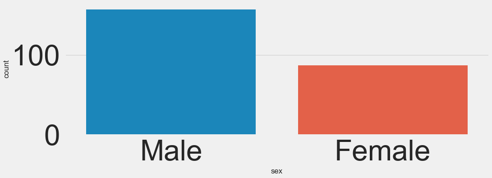
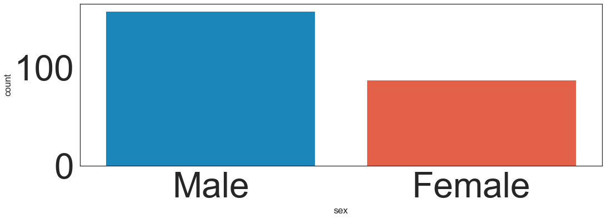
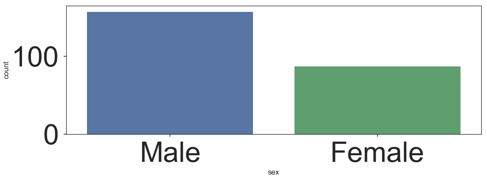
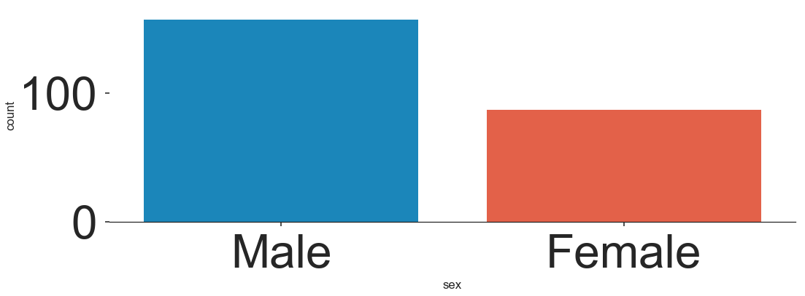
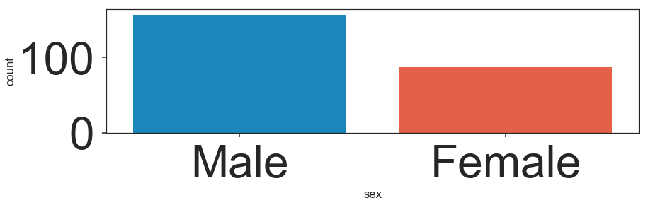
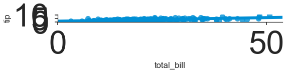

# Style and Color

We've shown a few times how to control figure aesthetics in seaborn, but let's now go over it formally:


```python
import seaborn as sns
import matplotlib.pyplot as plt

%matplotlib inline
plt.style.use('fivethirtyeight')
plt.rcParams['figure.figsize'] = (15,5)
tips = sns.load_dataset('tips')
```

## Styles

You can set particular styles:


```python
sns.countplot(x='sex',data=tips)
```


    <matplotlib.axes._subplots.AxesSubplot at 0x298158a3f98>





```python
sns.set_style('white')
sns.countplot(x='sex',data=tips)
```


    <matplotlib.axes._subplots.AxesSubplot at 0x29815ce0390>





```python
sns.set_style('ticks')
sns.countplot(x='sex',data=tips,palette='deep')
```


    <matplotlib.axes._subplots.AxesSubplot at 0x29815ce7048>





## Spine Removal


```python
sns.countplot(x='sex',data=tips)
sns.despine()
```


```python
sns.countplot(x='sex',data=tips)
sns.despine(left=True)
```





## Size and Aspect

You can use matplotlib's **plt.figure(figsize=(width,height) ** to change the size of most seaborn plots.

You can control the size and aspect ratio of most seaborn grid plots by passing in parameters: size, and aspect. For example:


```python
# Non Grid Plot
plt.figure(figsize=(12,3))
sns.countplot(x='sex',data=tips)
```


    <matplotlib.axes._subplots.AxesSubplot at 0x29815ec75c0>





```python
# Grid Type Plot
sns.lmplot(x='total_bill',y='tip',size=2,aspect=4,data=tips)
```


    ---------------------------------------------------------------------------

    ValueError                                Traceback (most recent call last)

    <ipython-input-18-5727bab2a1ca> in <module>()
          1 # Grid Type Plot
    ----> 2 sns.lmplot(x='total_bill',y='tip',size=2,aspect=4,data=tips)
    

    C:\ProgramData\Anaconda3\lib\site-packages\seaborn\linearmodels.py in lmplot(x, y, data, hue, col, row, palette, col_wrap, size, aspect, markers, sharex, sharey, hue_order, col_order, row_order, legend, legend_out, x_estimator, x_bins, x_ci, scatter, fit_reg, ci, n_boot, units, order, logistic, lowess, robust, logx, x_partial, y_partial, truncate, x_jitter, y_jitter, scatter_kws, line_kws)
        577         scatter_kws=scatter_kws, line_kws=line_kws,
        578         )
    --> 579     facets.map_dataframe(regplot, x, y, **regplot_kws)
        580 
        581     # Add a legend
    

    C:\ProgramData\Anaconda3\lib\site-packages\seaborn\axisgrid.py in map_dataframe(self, func, *args, **kwargs)
        795 
        796         # Finalize the annotations and layout
    --> 797         self._finalize_grid(args[:2])
        798 
        799         return self
    

    C:\ProgramData\Anaconda3\lib\site-packages\seaborn\axisgrid.py in _finalize_grid(self, axlabels)
        820         self.set_axis_labels(*axlabels)
        821         self.set_titles()
    --> 822         self.fig.tight_layout()
        823 
        824     def facet_axis(self, row_i, col_j):
    

    C:\ProgramData\Anaconda3\lib\site-packages\matplotlib\figure.py in tight_layout(self, renderer, pad, h_pad, w_pad, rect)
       1753                                          rect=rect)
       1754 
    -> 1755         self.subplots_adjust(**kwargs)
       1756 
       1757 
    

    C:\ProgramData\Anaconda3\lib\site-packages\matplotlib\figure.py in subplots_adjust(self, *args, **kwargs)
       1618 
       1619         """
    -> 1620         self.subplotpars.update(*args, **kwargs)
       1621         for ax in self.axes:
       1622             if not isinstance(ax, SubplotBase):
    

    C:\ProgramData\Anaconda3\lib\site-packages\matplotlib\figure.py in update(self, left, bottom, right, top, wspace, hspace)
        230             if self.bottom >= self.top:
        231                 reset()
    --> 232                 raise ValueError('bottom cannot be >= top')
        233 
        234     def _update_this(self, s, val):
    

    ValueError: bottom cannot be >= top





## Scale and Context

The set_context() allows you to override default parameters:


```python
sns.set_context('poster',font_scale=4)
sns.countplot(x='sex',data=tips,palette='coolwarm')
```

Check out the documentation page for more info on these topics:
https://stanford.edu/~mwaskom/software/seaborn/tutorial/aesthetics.html


```python
sns.puppyplot()
```

# Great Job!
